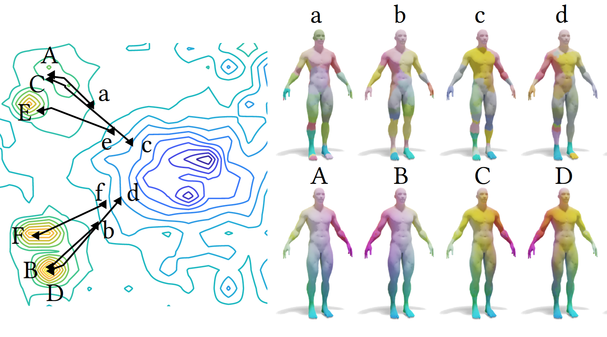
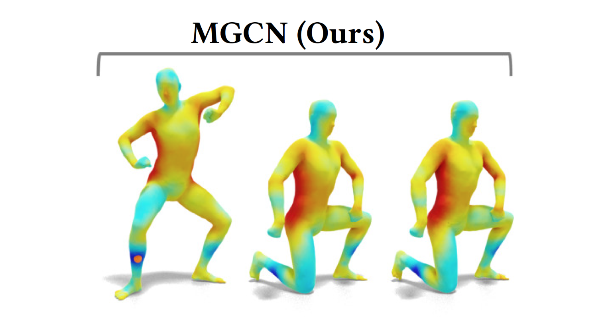
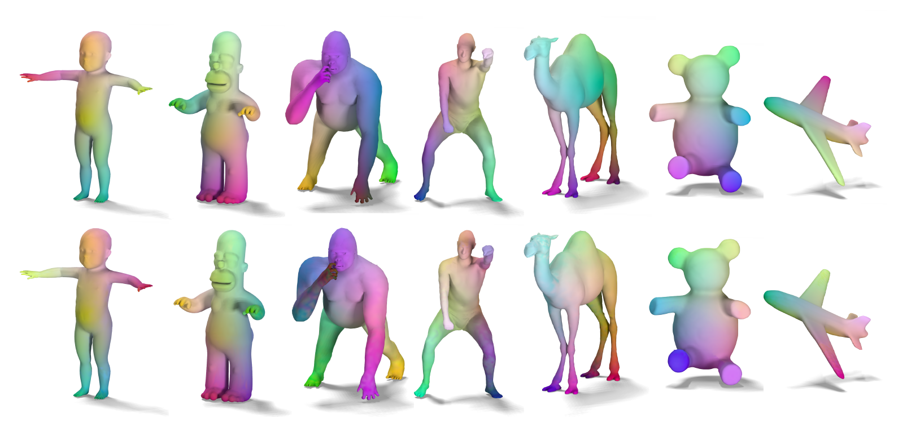

<link rel="stylesheet" href="bootstrap.css">

---
pagetitle: REN Jing
---

# About me

<figure>

</figure>

I am currently a Ph.D candidate in [VCC](https://cemse.kaust.edu.sa/vcc), [KAUST](https://www.kaust.edu.sa/en), supervised by Prof. [Peter Wonka](http://peterwonka.net/). Before that, I obtained the MSc. degree from [Oxford University](https://www.maths.ox.ac.uk/), UK, and the BSc. degree from [Zhejiang University](https://www.zju.edu.cn/english/), China.  My research is mainly related to shape analysis and geometry processing. I am also interested in computer graphics and computer vision in general. Currently I am working on shape matching with deep learning and shape reconstruction with optimization techiniques. 

 

You can find my full CV [here](http://llorz.github.io/files/cv.pdf).

 

# Publications

<figure>

</figure>

**MapTree: Recovering Multiple Solutions in the Space of Maps**
 

<u>Jing Ren</u>, Simone Melzi, Maks Ovsjanikov, Peter Wonka
 

*ACM Transactions on Graphics (Proc. SIGGRAPH Asia), 2020*
 

[<i class="fa fa-file-pdf"></i> paper](https://arxiv.org/abs/2006.02532)
[<i class="fa fa-code"></i> code](https://github.com/llorz/SGA20_mapExplor)
 

<figure>

</figure>

**MGCN: Descriptor Learning using Multiscale GCNs**
 

Yiqun Wang, <u>Jing Ren</u>, Dong-Ming Yan, Jianwei Guo, Xiaopeng Zhang, Peter Wonka
 

*ACM Transactions on Graphics (Proc. SIGGRAPH), 2020*
 

[<i class="fa fa-file-pdf"></i> paper](https://arxiv.org/abs/2001.10472)
[<i class="fa fa-code"></i> code](https://github.com/yiqun-wang/MGCN)
 

   
    

<figure>

</figure>

**Consistent ZoomOut: Efficient Spectral Map Synchronization**
 

Ruqi Huang, <u>Jing Ren</u>, Peter Wonka, Maks Ovsjanikov
 

*Computer Graphics Forum (Proc. SGP), 2020*
 

[<i class="fa fa-file-pdf"></i> paper](https://onlinelibrary.wiley.com/doi/abs/10.1111/cgf.14084)
[<i class="fa fa-code"></i> code](https://github.com/ruqihuang/SGP2020_ConsistentZoomOut)
 

    
    

<figure>

</figure>

**ZoomOut: Spectral Upsampling for Efficient Shape Correspondence**
 

Simone Melzi\*, <u>Jing Ren</u>\*, Emanuele Rodolà, Abhishek Sharma, Peter Wonka, and Maks Ovsjanikov
 

*ACM Transactions on Graphics (Proc. SIGGRAPH Asia), 2019*
 

[<i class="fa fa-file-pdf"></i> paper](https://www.dropbox.com/s/duhr5b426xb1q72/2019sga_zoomout.pdf?dl=0)
[<i class="fa fa-code"></i> code](https://github.com/llorz/SGA19_zoomOut)
[<i class="fa fa-file-powerpoint"></i> slides](https://www.dropbox.com/s/yvi1b6npk4kqlas/SGA19_zoomOut_slides.pdf?dl=0)  (\* equal contribution)
 

    

<figure>

</figure>

**Structured Regularization of Functional Map Computations**
 

<u>Jing Ren</u>, Mikhail Panine, Peter Wonka, and Maks Ovsjanikov
 

*Computer Graphics Forum (Proc. SGP), 2019*
 

[<i class="fa fa-file-pdf"></i> paper](https://www.dropbox.com/s/ctvor2e25eaaev6/2019SGP_Structured_Regularization_fMap.pdf?dl=0)
[<i class="fa fa-code"></i> code](https://github.com/llorz/SGP19_complex_resolvent_laplacian)
[<i class="fa fa-file-powerpoint"></i> slides](https://www.dropbox.com/s/ah8if4wywfr98su/SGP19_complex_resolvent_laplacian.pdf?dl=0)
 

<figure>

</figure>

**Continuous and Orientation-preserving Correspondence via Functional Maps**
 

<u> Jing Ren</u>, Adrien Poulenard, Peter Wonka, and Maks Ovsjanikov
 

*ACM Transactions on Graphics (Proc. SIGGRAPH Asia), 2018*
 

[<i class="fa fa-file-pdf"></i> paper](https://www.dropbox.com/s/j0r4x5yul5s76rw/2018SGA_orientation_BCICP.pdf?dl=0)
[<i class="fa fa-code"></i> code](https://github.com/llorz/SGA18_orientation_BCICP_code)
[<i class="fa fa-file-powerpoint"></i> slides](https://www.dropbox.com/s/uc7501d81vxbip5/SGA18_orientation_slides.pdf?dl=0)
 

    
    

<figure>

</figure>

**Joint Graph Layouts for Visualizing Collections of Segmented Meshes**
 

<u>Jing Ren</u>, Jens Schneider, Maks Ovsjanikov, and Peter Wonka
 

*IEEE Transactions on Visualization and Computer Graphics (TVCG), 2017*
 

[<i class="fa fa-file-pdf"></i> paper](https://ieeexplore.ieee.org/document/8031987/)
[<i class="fa fa-code"></i> code](https://github.com/llorz/TVCG17_JointMap_code)
[<i class="fa fa-file-powerpoint"></i> slides](https://www.dropbox.com/s/l73hp1ty1o4nofz/SGP19_TVCG17_jointLayout.pdf?dl=0)
 

 

# Education

  

  

Ph.D. Candidate in Computer Science 
KAUST, Visual Computing Center 
2015-Present 

  

  

  

M.Sc. in Financial Mathematics 
Oxford University 
2014-2015 

  

  

  

B.Sc. Math and Applied Math 
Zhejiang University 
2010-2014 

 

# Research Internship

  

  

Alibaba, DAMO Academy, AI Center (City Brain) 
Supervised by Dr. Chang Zhou and Dr. Lubin Fan 
July - Dec 2020 

École Polytechnique, LIX 
Supervised by Prof. Maks Ovsjanikov 
Jun - Aug 2017, 2018, 2019 

  

