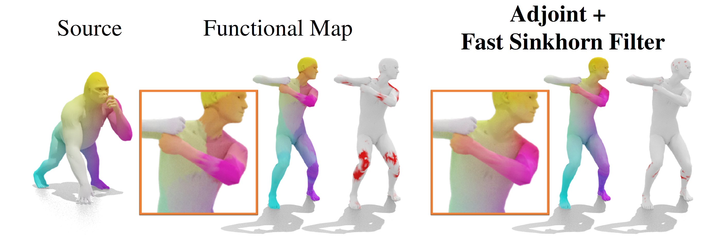
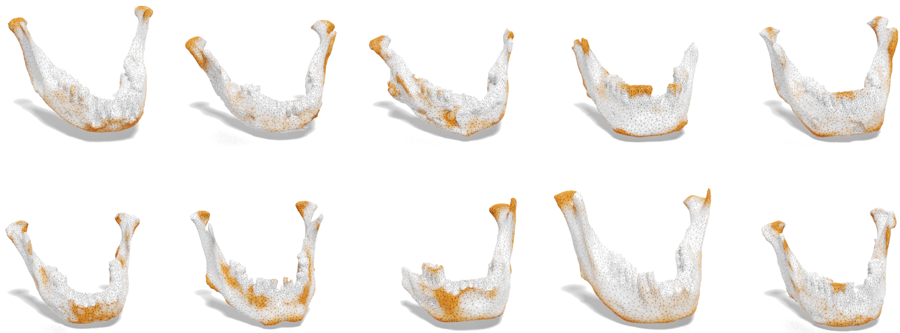
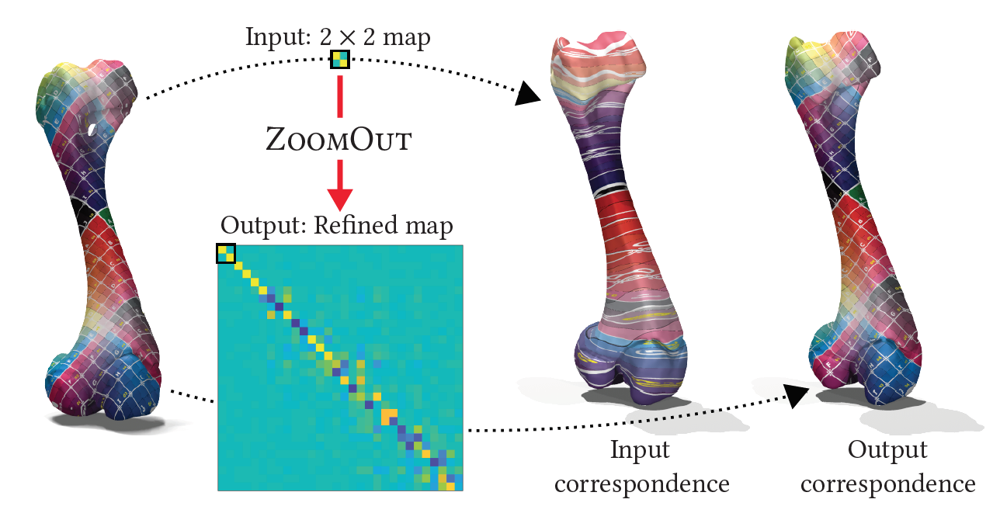
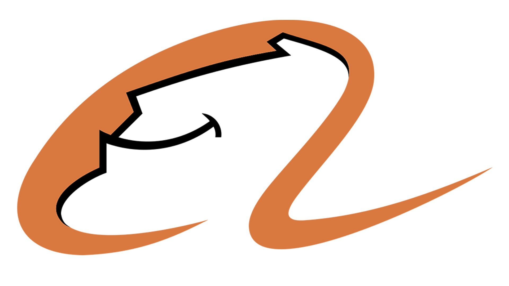

<link rel="stylesheet" href="css/bootstrap.css">
<link rel="stylesheet" href="css/academicons.css">

---
pagetitle: REN Jing
---

<h1 id="home"> About me </h1>

<figure>

</figure>

I am currently a Ph.D candidate in [VCC](https://cemse.kaust.edu.sa/vcc), [KAUST](https://www.kaust.edu.sa/en), supervised by Prof. [Peter Wonka][peter]. Before that, I obtained the MSc. degree from [Oxford University](https://www.maths.ox.ac.uk/), UK, and the BSc. degree from [Zhejiang University](https://www.zju.edu.cn/english/), China.  My research is mainly related to shape analysis and geometry processing. I am also interested in computer graphics and computer vision in general. Currently I am working on shape matching with deep learning and shape reconstruction with optimization techniques. 

You can find my full CV [here](http://llorz.github.io/files/cv.pdf).

<h1 id="pub">Publications  <!---<a href="https://orcid.org/0000-0003-3114-3517" style="color: #b2c046;font-size:22px"><i class="ai ai-orcid ai-lg"></i></a>&nbsp;<a href="https://arxiv.org/a/ren_j_2.html" style="color: #b31b1b; font-size:22px"><i class="ai ai-arxiv ai-lg"></i></a>&nbsp;<a href="https://scholar.google.com/citations?user=qkadBVcAAAAJ&hl=en" style="color: gray; font-size:22px"><i class="ai ai-google-scholar ai-lg"></i></a>&nbsp;<a href="https://github.com/llorz" style="color:#A34DAD; font-size:22px"><i class="fa fa-github fa-lg"></i></a> 
--->
</h1>

  Jump to year: &nbsp;
  <a href="#2021" style="font-family:optima">2021</a>,&nbsp;
  <a href="#2020" style="font-family:optima">2020</a>,&nbsp;
  <a href="#2019" style="font-family:optima">2019</a>,&nbsp;
  <a href="#2018" style="font-family:optima">2018</a>,&nbsp;
  <a href="#2017" style="font-family:optima">2017</a>.

<h3 id="2021"> 2021</h3> 

<!---

<figure>

</figure>

**Shape Matching and Map Space Exploration via Functional Maps**
 

<u>Jing Ren</u>
 

*PhD Thesis, 2021*
 

[<i class="fa fa-file-pdf"></i> paper]()
 

<figure>

</figure>

**Interactive Reconstruction and Generative Modeling of Roof Meshes**
 

<u>Jing Ren</u>, [Biao Zhang][biao], [Bojiang Wu][bojian], [Lubin Fan][lubin], [Jianqiang Huang][hjq], [Maks Ovsjanikov][maks], [Peter Wonka][peter]
 

 

[<i class="fa fa-file-pdf"></i> paper]()&nbsp;
[<i class="fa fa-code"></i> code]()&nbsp;
[<i class="fa fa-video"></i> video]()
 

--->

<figure>

</figure>

**Fast Sinkhorn Filters: Using Matrix Scaling for Non-Rigid Shape Correspondence with Functional Maps**
 

[Gautam Pai][gautam], <u>Jing Ren</u>, [Simone Melzi][simone], [Peter Wonka][peter],  [Maks Ovsjanikov][maks] 
 

*Proc. IEEE Conference on Computer Vision and Pattern Recognition (CVPR), 2021*
 

[<i class="fa fa-file-pdf"></i> paper]()&nbsp;
[<i class="fa fa-file-pdf"></i> suppl.]()&nbsp;
[<i class="fa fa-code"></i> code](https://github.com/paigautam/CVPR21_FastSinkhornFilters)
 

<h3 id="2020">2020</h3> 

<figure>

</figure>

**Geometric analysis of shape variability of lower jaws of prehistoric humans**
 

<u>Jing Ren</u>, [Peter Wonka][peter], [Gowtham Harihara][gowtham], [Maks Ovsjanikov][maks]
 

*L'Anthropologie, 2020*
 

[<i class="fa fa-file-pdf"></i> paper (official)](https://www.sciencedirect.com/science/article/pii/S0003552120301035)&nbsp;
[<i class="fa fa-file-pdf"></i> paper (preprint)](https://www.dropbox.com/s/7ef6wokei08y4sr/2020_jaws.pdf?dl=0)&nbsp;
[<i class="fa fa-code"></i> code](https://github.com/llorz/PROJ2020_jaws)
 

<figure>

</figure>

**MapTree: Recovering Multiple Solutions in the Space of Maps**
 

<u>Jing Ren</u>, [Simone Melzi][simone], [Maks Ovsjanikov][maks], [Peter Wonka][peter]
 

*ACM Transactions on Graphics (Proc. SIGGRAPH Asia), 2020*
 

[<i class="fa fa-file-pdf"></i> paper](https://arxiv.org/abs/2006.02532)&nbsp;
[<i class="fa fa-code"></i> code](https://github.com/llorz/SGA20_mapExplor)&nbsp;
[<i class="fa fa-file-powerpoint"></i> slides](https://www.dropbox.com/s/njfuc2v93vn46ny/SGA20_maptree.pdf?dl=0)&nbsp;
[<i class="fa fa-video"></i> presentation](https://www.dropbox.com/s/buswufwklzuaa7s/SGA20_maptree_presentation.mp4?dl=0)
 

<figure>

</figure>

**MGCN: Descriptor Learning using Multiscale GCNs**
 

[Yiqun Wang][yiqun], <u>Jing Ren</u>, [Dong-Ming Yan][dongming], [Jianwei Guo][jianwei], [Xiaopeng Zhang][zxp], [Peter Wonka][peter]
 

*ACM Transactions on Graphics (Proc. SIGGRAPH), 2020*
 

[<i class="fa fa-file-pdf"></i> paper](https://arxiv.org/abs/2001.10472)&nbsp;
[<i class="fa fa-code"></i> code](https://github.com/yiqun-wang/MGCN)&nbsp;
[<i class="fa fa-file-powerpoint"></i> slides](https://drive.google.com/file/d/1s1lGZ5THV7OM9l1t5C_ZClmyAT2MkDjt/view)
 

   
    

<figure>

</figure>

**Consistent ZoomOut: Efficient Spectral Map Synchronization**
 

[Ruqi Huang][ruqi], <u>Jing Ren</u>, [Peter Wonka][peter], [Maks Ovsjanikov][maks]
 

*Computer Graphics Forum (Proc. SGP), 2020*
 

[<i class="fa fa-file-pdf"></i> paper](https://onlinelibrary.wiley.com/doi/abs/10.1111/cgf.14084)&nbsp;
[<i class="fa fa-code"></i> code](https://github.com/ruqihuang/SGP2020_ConsistentZoomOut)&nbsp;
[<i class="fa fa-video"></i> presentation](https://www.youtube.com/watch?v=WhduuY9o8QQ&t=24s&ab_channel=RuqiHuang)
 

<h3 id="2019"> 2019</h3> 

    

<figure>

</figure>

**ZoomOut: Spectral Upsampling for Efficient Shape Correspondence**
 

[Simone Melzi\*][simone], <u>Jing Ren</u>\*, [Emanuele Rodolà][ema], [Abhishek Sharma][abhishek], [Peter Wonka][peter], [Maks Ovsjanikov][maks]
 

*ACM Transactions on Graphics (Proc. SIGGRAPH Asia), 2019*
 

[<i class="fa fa-file-pdf"></i> paper](https://www.dropbox.com/s/duhr5b426xb1q72/2019sga_zoomout.pdf?dl=0)&nbsp;
[<i class="fa fa-code"></i> code](https://github.com/llorz/SGA19_zoomOut)&nbsp;
[<i class="fa fa-file-powerpoint"></i> slides](https://www.dropbox.com/s/yvi1b6npk4kqlas/SGA19_zoomOut_slides.pdf?dl=0)  (\* equal contribution)
 

    

<figure>

</figure>

**Structured Regularization of Functional Map Computations**
 

<u>Jing Ren</u>, [Mikhail Panine][mikhail], [Peter Wonka][peter], [Maks Ovsjanikov][maks]
 

*Computer Graphics Forum (Proc. SGP), 2019*
 

[<i class="fa fa-file-pdf"></i> paper](https://www.dropbox.com/s/ctvor2e25eaaev6/2019SGP_Structured_Regularization_fMap.pdf?dl=0)&nbsp;
[<i class="fa fa-code"></i> code](https://github.com/llorz/SGP19_complex_resolvent_laplacian)&nbsp;
[<i class="fa fa-file-powerpoint"></i> slides](https://www.dropbox.com/s/ah8if4wywfr98su/SGP19_complex_resolvent_laplacian.pdf?dl=0)
 

<h3 id="2018"> 2018</h3> 

<figure>

</figure>

**Continuous and Orientation-preserving Correspondence via Functional Maps**
 

<u> Jing Ren</u>, [Adrien Poulenard][adrien], [Peter Wonka][peter], [Maks Ovsjanikov][maks]
 

*ACM Transactions on Graphics (Proc. SIGGRAPH Asia), 2018*
 

[<i class="fa fa-file-pdf"></i> paper](https://www.dropbox.com/s/j0r4x5yul5s76rw/2018SGA_orientation_BCICP.pdf?dl=0)&nbsp;
[<i class="fa fa-code"></i> code](https://github.com/llorz/SGA18_orientation_BCICP_code)&nbsp;
[<i class="fa fa-file-powerpoint"></i> slides](https://www.dropbox.com/s/uc7501d81vxbip5/SGA18_orientation_slides.pdf?dl=0)
 

    
    

<h3 id="2017"> 2017</h3> 

<figure>

</figure>

**Joint Graph Layouts for Visualizing Collections of Segmented Meshes**
 

<u>Jing Ren</u>, [Jens Schneider][jens], [Maks Ovsjanikov][maks], [Peter Wonka][peter]
 

*IEEE Transactions on Visualization and Computer Graphics (TVCG), 2017*
 

[<i class="fa fa-file-pdf"></i> paper](https://ieeexplore.ieee.org/document/8031987/)&nbsp;
[<i class="fa fa-code"></i> code](https://github.com/llorz/TVCG17_JointMap_code)&nbsp;
[<i class="fa fa-file-powerpoint"></i> slides](https://www.dropbox.com/s/l73hp1ty1o4nofz/SGP19_TVCG17_jointLayout.pdf?dl=0)&nbsp;
[<i class="fa fa-video"></i> video](https://www.youtube.com/watch?v=Z-mr97gtMcM&ab_channel=PeterWonkaResearch)
 

<h1> Education </h1>

Ph.D. in Computer Science
 

**KAUST, Visual Computing Center**
 

*2015 - 2021*
 

M.Sc. in Financial Mathematics
 

**Oxford University**
 

*2014 - 2015*
 

B.Sc. in Math and Applied Math
 

**Zhejiang University**
 

*2010 - 2014*
 

<h1> Research Experience  </h1>

**Alibaba, DAMO Academy, AI Center (City Brain)**
 

Supervised by Dr. [Lubin Fan][lubin]
 

*July 2020 - June 2021*
 

**Ecole Polytechnique, LIX**
 

Supervised by Prof. [Maks Ovsjanikov][maks]
 

*Jun - Aug 2017, 2018, 2019*
 

[peter]: http://peterwonka.net/
[maks]: http://www.lix.polytechnique.fr/~maks/
[simone]: https://sites.google.com/site/melzismn/
[yiqun]: https://sites.google.com/view/yiqun-wang/home
[ruqi]: https://novalhuang.wixsite.com/rhuang
[bojian]: https://bojianwu.github.io/
[lubin]: https://lubinfan.github.io/
[gautam]: https://sites.google.com/view/paigautam/home
[abhishek]: https://not-iitian.github.io/
[dongming]: https://sites.google.com/site/yandongming/
[jens]: https://scholar.google.de/citations?user=em4IRO4AAAAJ&hl=en
[biao]: https://scholar.google.com/citations?user=h5KukxEAAAAJ&hl=en
[adrien]: https://scholar.google.com/citations?user=zsGbyGYAAAAJ&hl=fr
[mikhail]: https://dblp.org/pid/230/7842.html
[ema]: https://sites.google.com/site/erodola/
[jianwei]: https://jianweiguo.net/
[zxp]: http://people.ucas.ac.cn/~zhangxiaopeng?language=en#%20155727
[hjq]: https://scholar.google.com.hk/citations?user=UqAybqgAAAAJ&hl=en
[gowtham]: https://www.researchgate.net/profile/Harihara-Gowtham